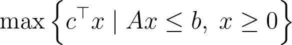

This is a simple program in Julia that solves a linear optimization problem.

The exact problem here is

and more generally

I have modelled this with GLPK in Julia and it uses a (MI)LP solver to find the optimal solution.
For different values you need to change the vectors $$c$$, $$b$$ and the matrix $$A$$. Additionally you can set $$integer\_solution$$ to $$true$$ and then your variables will have integer solutions.

What else can I say... Idk
